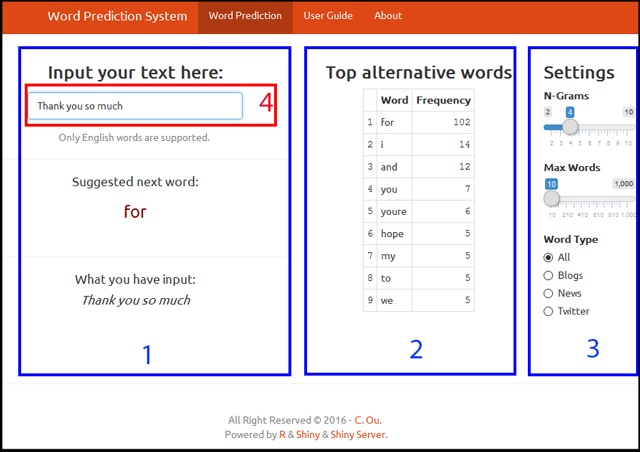

## Capstone Project of Coursera Data Science Specialization 
### Word Prediction System
 
******
This application of Word Prediction System is the capstone project for the Coursera Data Science specialization held by professors of the Johns Hopkins University and in cooperation with SwiftKey. The detailed information regarding the capstone project, please see <https://www.coursera.org/learn/data-science-project>.

     

******
#### User Guide of the Application

This application can be accessed via <https://fooway.shinyapps.io/DataSci_Capstone_Project>. It can support most of devices like personal computers (PCs), tablets and smartphones. 

The main user interface is shown as below.

It includes three Tabs:
* Tab 1 - Word Prediction
* Tab 2 - User Guide 
* Tab 3 - About

******
##### Tab 1 - Word Prediction

The user interface of Tab 1 (Word Prediction) contains three columns. 

Column (**1**) was designed for entering the text (**4**), the field with the suggested next word refreshes instantaneously and  also the whole text input gets displayed. If "suggested next word" shows "NA", it means that the prediction word is "Not Available".

Column (**2**) was designed for showing the top alternative words. The maximum words can be set up in the column (**3**).

Column (**3**) was designed for setting up the Application parameters. "N-Grams" can be chosen from 2-Grams to 10-Grams models. "Max Words" contols the maximum words in the column (**2**). "Word Type" can be "All", "Blog", "News" and "Twitter". "All" inlcudes "Blog", "News" and "Twitter". According to the Milestone Report, the "Twiter" type is quite different with others due to using loads of abbreviations. This **Lite Version** application has removed most of frequency dictionaries of 5-Grams and 10-Grams due to limited free ShinyApps.io server space offer. 

******
##### Tab 2 - User Guide 

The user interface of Tab 2 (User Guide) is this document which you are reading.

******
##### Tab 3 - About

The user interface of Tab 3 (About) describes the system objectives and adapted methods and database design.

******

#### More Information

* The Word Prediction System is hosted on shinyapps.io: [https://fooway.shinyapps.io/DataSci_Capstone_Project](https://fooway.shinyapps.io/DataSci_Capstone_Project)

* The whole code of this application, as well as all the milestone report, related scripts, this presentation  etc. can be found in this GitHub repo: [https://github.com/Fooway/DataSci_Capstone_Project.git](https://github.com/Fooway/DataSci_Capstone_Project.git)

* This pitch deck is located here: [http://rpubs.com/Fooway/DataSci_Capstone_Project](http://rpubs.com/Fooway/DataSci_Capstone_Project)

* Learn more about the Coursera Data Science Specialization: [https://www.coursera.org/specialization/jhudatascience/1](https://www.coursera.org/specialization/jhudatascience/1)
******
